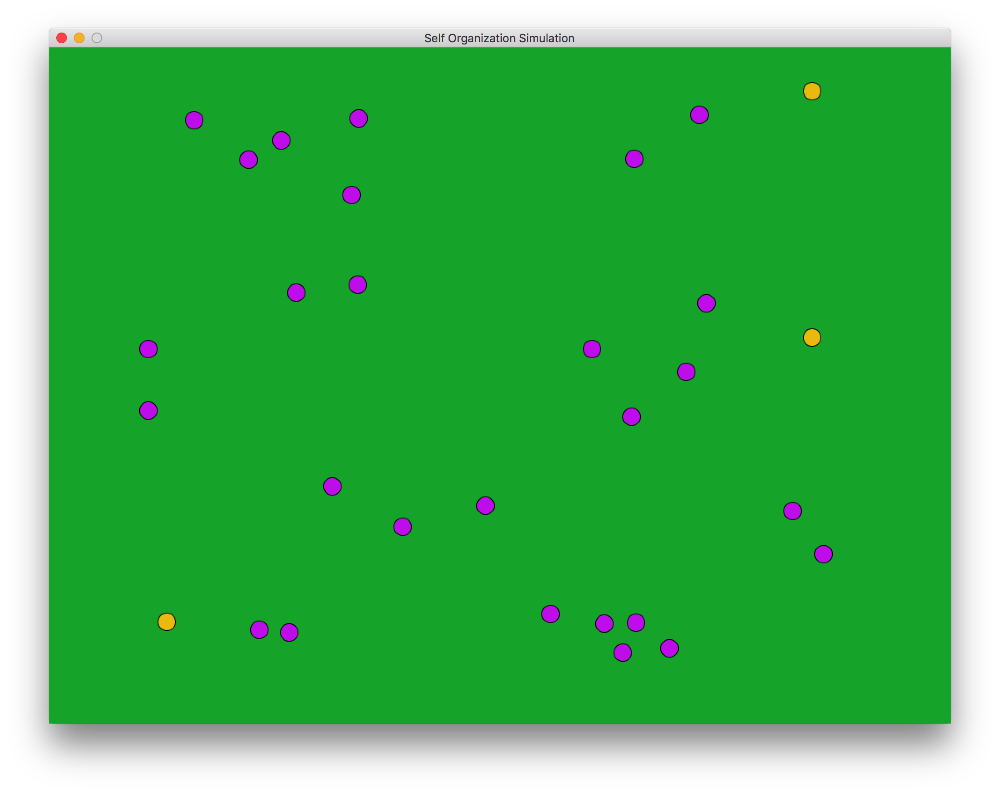
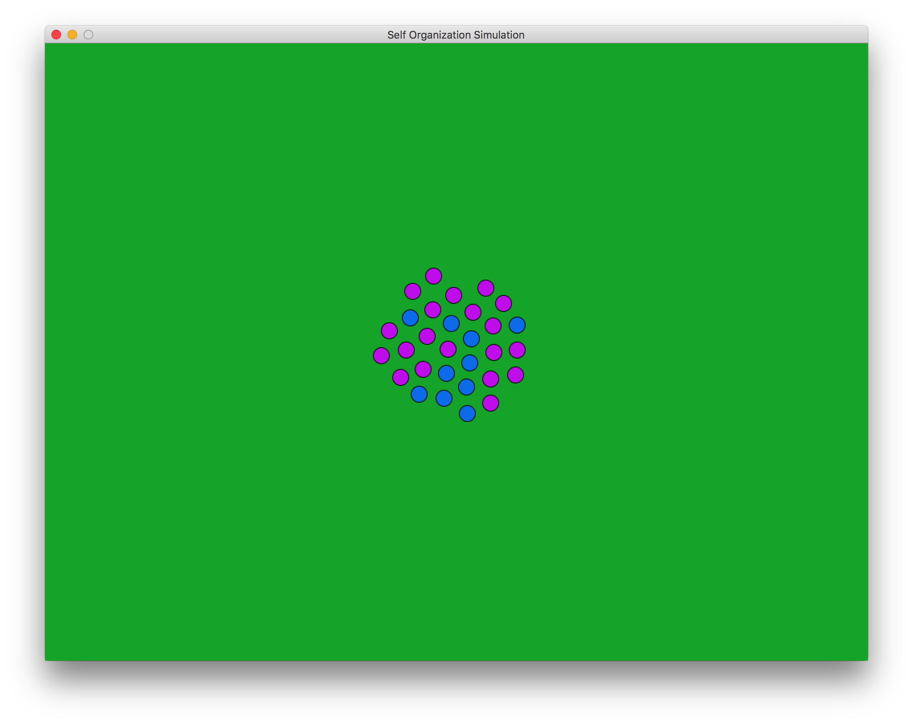

Self Organization Simulator
===========================

This software simulates a number of "bugs" that are aware of their position and limited information about their neighbors, but have no higher governing body. Each turn bugs make movement decisions based on their surroundings, and eventually structured behavior appears!

To run
------

You will need a copy of [Processing](https://processing.org/) installed, as well as [JRuby](http://jruby.org/download) and [JRubyArt](https://github.com/ruby-processing/JRubyArt).

Installation instructions for all three are linked above.

Once the prerequisites are installed you can run the project by launching the shell script `./run.sh`, or manually, with `k9 run main.rb`.

To build your own behavior
--------------------------

To write your own bug behavior simply make a new ruby file in the "behaviors" folder. An example is provided in "behaviors/cluster.rb" with more detailed instructions.

Once you have written your own behavior you will want to edit "configuration.rb" to set your new behavior and change any parameters like screen size or starting number of bugs. Then you're ready!

Screenshots
-----------

Here's some bugs shortly after initialization, while they're still spread across the field:

And here are those same bugs a while later, clustered near one another:

